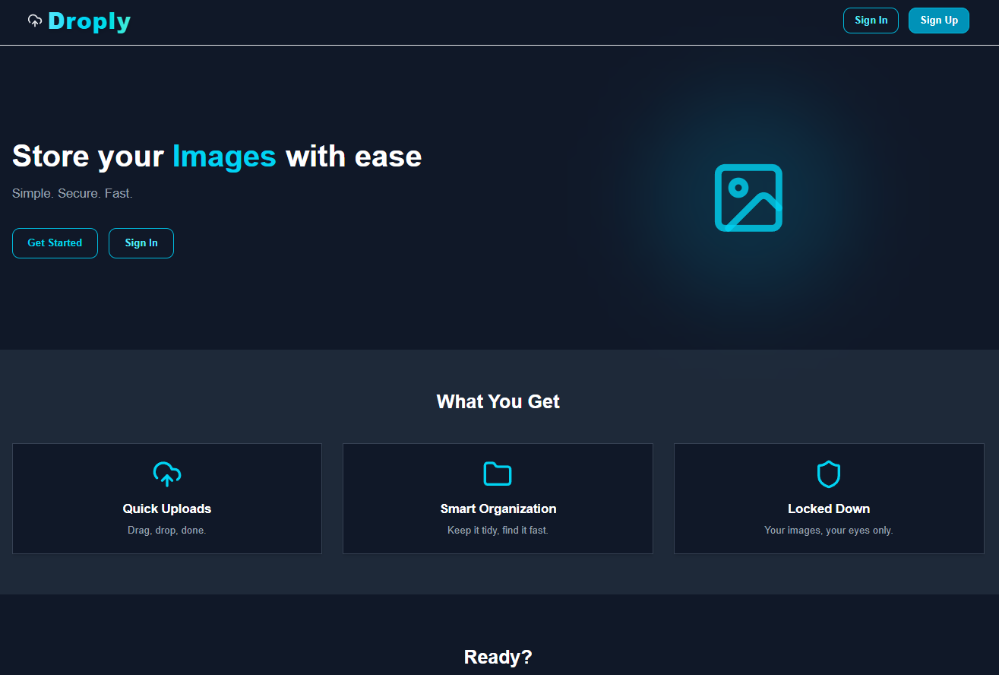
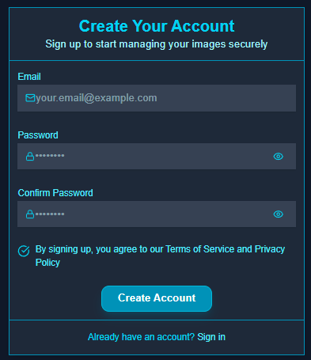
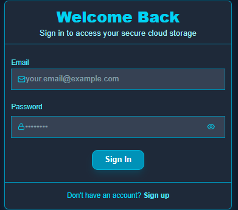

# Droply

A simple file storage application built with Next.js, Clerk, Neon, Drizzle, and HeroUI.

## Features

- User authentication with Clerk
- File uploads with ImageKit
- File management (star, trash, download, preview)
- Responsive UI with HeroUI

## Tech Stack

- **Frontend**: Next.js, HeroUI
- **Authentication**: [Clerk](https://clerk.com/)
- **Database**: Neon (PostgreSQL) [Neon](https://neon.com/)
- **ORM**: Drizzle
- **File Storage**: [ImageKit](https://imagekit.io/)

## UI





## Getting Started

### Prerequisites

- Node.js 18+ and npm
- Clerk account
- Neon PostgreSQL database
- ImageKit account

### Installation

1. Clone the repository:

   ```bash
   git clone https://github.com/AnuragSingh2101/Droply
   cd droply
   ```

2. Install dependencies:

   ```bash
   npm install
   # or
   yarn install
   # or
   pnpm install
   ```

3. Create a `.env.local` file in the root directory with the following environment variables:

   ```
   # Clerk Authentication
   NEXT_PUBLIC_CLERK_PUBLISHABLE_KEY=your_clerk_publishable_key
   CLERK_SECRET_KEY=your_clerk_secret_key

   # ImageKit
   NEXT_PUBLIC_IMAGEKIT_PUBLIC_KEY=your_imagekit_public_key
   IMAGEKIT_PRIVATE_KEY=your_imagekit_private_key
   NEXT_PUBLIC_IMAGEKIT_URL_ENDPOINT=your_imagekit_url_endpoint

   # Clerk URLs
   NEXT_PUBLIC_CLERK_SIGN_IN_URL=/sign-in
   NEXT_PUBLIC_CLERK_SIGN_UP_URL=/sign-up
   NEXT_PUBLIC_CLERK_AFTER_SIGN_IN_URL=/dashboard
   NEXT_PUBLIC_CLERK_AFTER_SIGN_UP_URL=/dashboard

   # Fallback URLs
   NEXT_PUBLIC_CLERK_SIGN_IN_FALLBACK_REDIRECT_URL=/
   NEXT_PUBLIC_CLERK_SIGN_UP_FALLBACK_REDIRECT_URL=/

   # App URLs
   NEXT_PUBLIC_APP_URL=http://localhost:3000

   # Database - Neon PostgreSQL
   DATABASE_URL=your_neon_database_url
   ```

4. Set up your accounts and get the required API keys:
   - Create a [Clerk](https://clerk.dev/) account and get your API keys
   - Create a [Neon](https://neon.tech/) PostgreSQL database and get your connection string
   - Create an [ImageKit](https://imagekit.io/) account and get your API keys

### Running the Application

1. Run the development server:

   ```bash
   npm run dev
   # or
   yarn dev
   # or
   pnpm dev
   ```

2. Open [http://localhost:3000](http://localhost:3000) in your browser to see the application.

### Building for Production

1. Build the application:

   ```bash
   npm run build
   # or
   yarn build
   # or
   pnpm build
   ```

2. Start the production server:
   ```bash
   npm start
   # or
   yarn start
   # or
   pnpm start
   ```